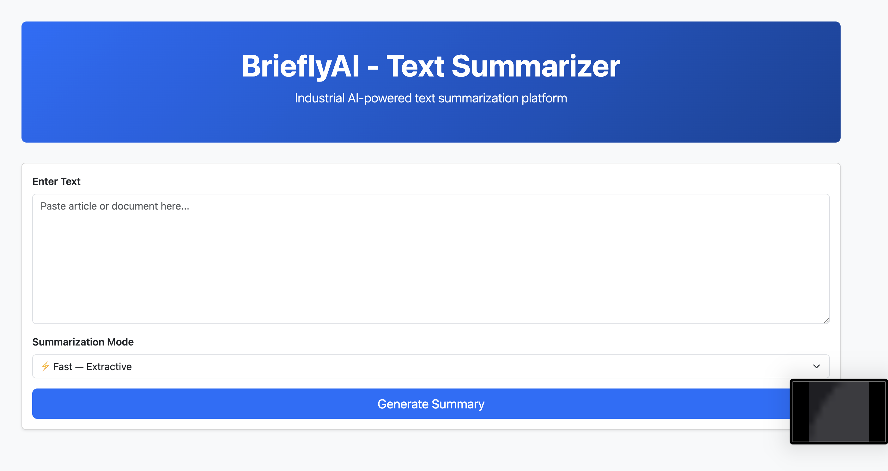
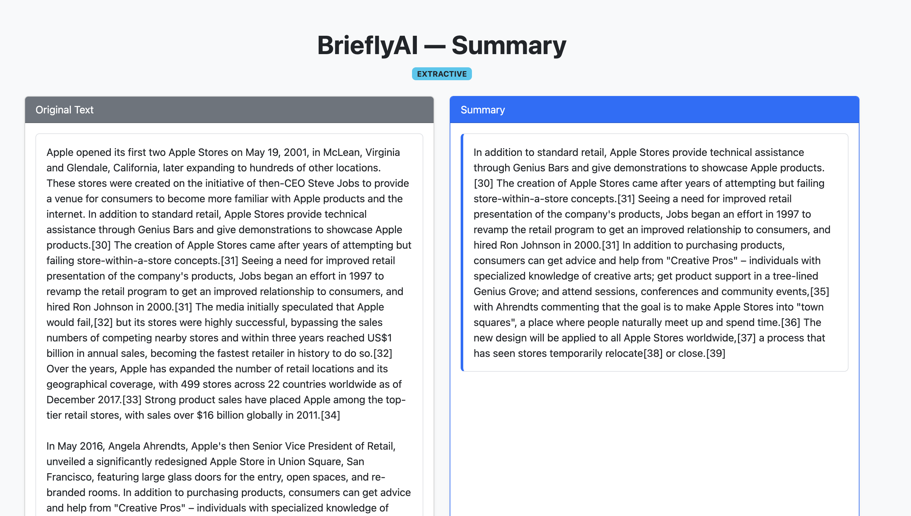
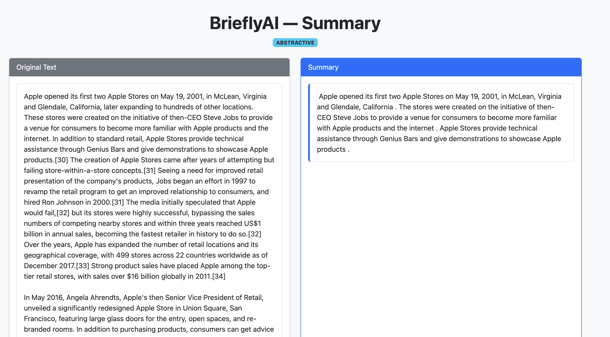

# BrieflyAI 🚀

### Industrial Text Summarization Platform

BrieflyAI is a production-grade NLP web application that generates high-quality,
concise summaries using a **hybrid extractive + abstractive pipeline**. The system
is optimized for **CPU-based deployment** using a **distilled BART transformer model**,
making it both **efficient and deployable** on low-resource cloud environments.

The application intelligently handles long documents through **chunking**, improves
latency via **caching**, and provides an intuitive **Flask-based web interface** with
multiple summarization modes.

---

## 🚀 Key Features
- ⚡ **Extractive summarization** using spaCy for fast responses
- 🧠 **Abstractive summarization** using a distilled BART transformer
- 📄 **Long-document support** via token-safe chunking
- ♻️ **LRU caching** to reduce repeated inference cost
- 🎛️ **User-selectable modes** (Fast vs AI)
- 🌐 **Production-ready Flask UI**

---

## 🖼️ Screenshots

### 🔹 Summarization Panel

### 🔹 Extractive Summarization (Fast Mode)

### 🔹 Abstractive Summarization (AI Mode)

---

## 🧱 Tech Stack
Flask · spaCy · Transformers · PyTorch · Bootstrap · Render

---

## 🔗 Live Demo
👉 

---
